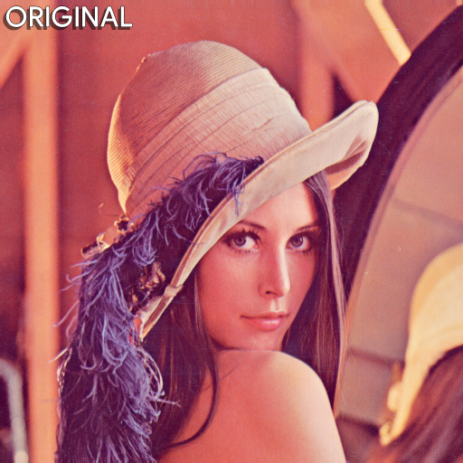
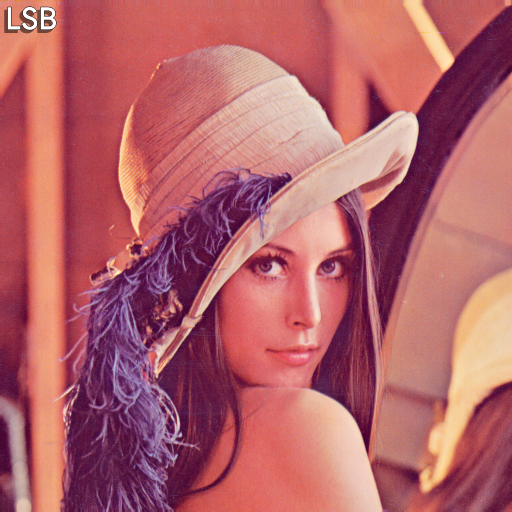
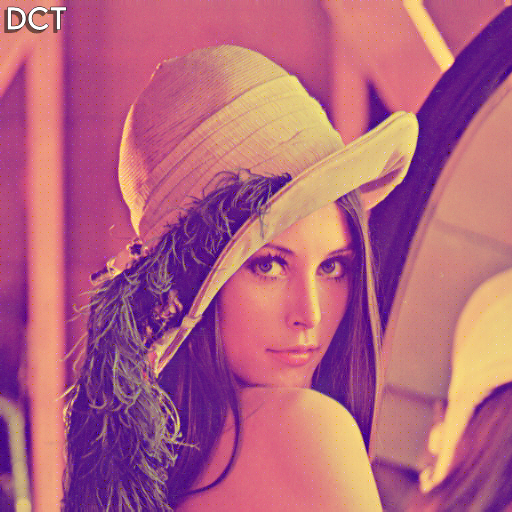
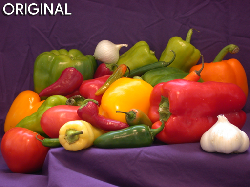
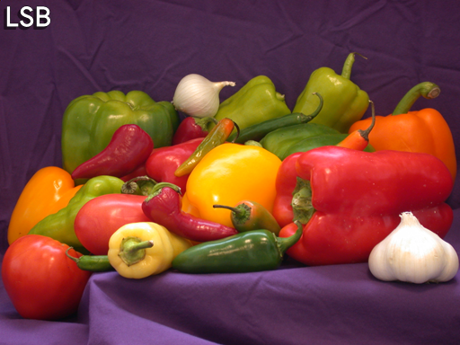
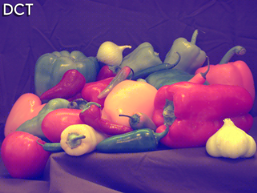
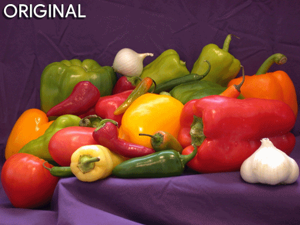
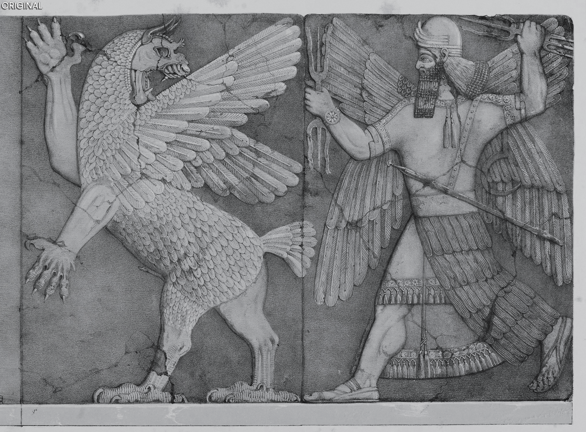

# Steganography
***Hide text messages in images***
## Description
(**TL;DR :**   *This program can hide a text message in an image, which can only be decoded by this program only.*)     

Steganography can be divided into two types:
  1. Spatial domain transformation:  
      - **LSB** (Least Significant Bit) transformation.
  2. Frequency domain transformation:  
      - **DCT** (Discrete Cosine Transformation).
      - **DWT** (Discrete Wavelet Transformation).  

If you want to know about the transformations, and how they are performed, check out our [Project Paper](Detailed_theory_paper/steganography.pdf).

## Usage:

Make sure you have **pip** installed!

Go to your terminal. And run the following command to install dependencies: 

```console
pip install -r requirements.txt
```
Now to run the program, run the following command:

```console
python watermarking.py 
```

It will create 3 new folders `(it will overwrite if those folders previously exixsted)` named ***"Encoded_image"*** , ***"Decoded_output"*** and ***"Comparison_result"***.    

### Encoding:    
`Pressing 1` will ask you which carrier image you want to use, remember to enter full name of any of the file.  
```
lenna.png
pepper.png
babylon.png
```  
***You can also use any image you want as carrier, but make sure to add them inside the folder named "Original_image"*** 

Now this will ask you to enter the text which you want to hide inside that image.     
Then it will encode your text in the image and save it inside the folder named ***"Encoded_image"***.    

### Decoding:     
`Pressing 2` will create decoded `text file` from the image in the folder named ***"Decoded_output"*** which contains the text you entered earlier.  

### Comparison:    
`Pressing 3` will create a `spreadsheet file` with the details of **MSE** (Mean Square Error) and **PSNR** (Peak Signal to Noise Ratio) in the folder named ***"Comparison_result"***.  

    

##

## Now let's see what changed visually:    
### Lenna:
      
### Here is the comparison:
  

### Pepper:
      
### Here is the comparison:
  

### Babylon:
      
### Here is the comparison:
  

## Known issues:

```
DCT:
  You can see blue tint on the DCT encoded images.
  This code is now working on the blue channel of the images.
  If I specify any other RGB channel, like red or green, It gets tinted with that exact channel colour.
DWT:
  DWT doesn't work in this code for now.
```

## To-do:
***Add implementation of DWT in this program.***
